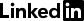

<!--
 * Template Name      : LinkedIn
 * Template Version   : V 1.0.0
 * Template Url       : .....................
 * Language           : React with TypeScript
 * Contact Me : Skaype   :- Boudraa.Hammani
 *				      Facebook :- Ham mani
 *				      Email    :- Ham47mani@gmail.com
-->

<!-- PROJECT LOGO -->
 

  

  <h1 align="center">LinkedIn Clone</h1>

  

    LinkedIn Clone, this work  make it as a practice for Firebase.
     
    <a href="https://hb-linkedin-clone.vercel.app/">View Demo</a>
    ·
    <a href="https://github.com/Ham47Mani/linkedin-clone/issues">Report Bug</a>
    ·
    <a href="https://github.com/Ham47Mani/linkedin-clone/issues">Request Feature</a>
  

 
 

 
 
 

<!-- TABLE OF CONTENTS -->

  
Table of Contents

  <ol>
    <li>
      <a href="#about-the-project">About The Project</a>
      <ul>
        <li><a href="#built-with">Built With</a></li>
        <li><a href="#CSS & JS Library">CSS & JS library</a></li>
      </ul>
    </li>
    <li><a href="#contact">Contact</a></li>
  </ol>

<!-- ABOUT THE PROJECT -->
# About The Project

<b>twitter-v1</b> is a simple twitter clone, i make this simple website as a practice for nextjs & tailwindcss

## Built With

I use i this template :

* React (With Vite)
* SASS (CSS)
* TypeScript
* Redux Toolkits
* Firebase

## CSS & JS Library
* React-icon
* React-player

<!-- CONTACT -->
## Contact

Hammani BOUDRAA - [@HAM47MANI](https://twitter.com/Ham7Mani) - Ham47mani@gmail.com
